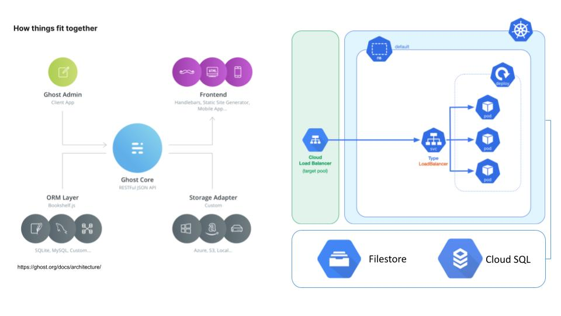

# Ghost Kubernetes

This directory contains objects to create Ghost Kubernetes Application and its dependencies including Deployment, Service, HPA, Configmap & Ingress.

- K8s Deployment to release new versions of the application multiple times per day without downtime.
- K8s HPA so the number of Pods can be incresead to handle of up to 4 times the typical load.
- To prevent from security exposure, GKE cluster runs in Private configuration. Therefore, Ghost K8s exposes the App with external LoadBalancer managed with the K8s Ingress.

## Ghost Architectural Design

  

## Proof of Concepts Assumptions:
- An embedded SQL Lite in the Docker image. In a production Environment GCP Cloud SQL is required for external persistency.
- NFS as Kubernetes deployment was used as Ghost requires shared WriteRead disk. In a production Environment GCP Filestore is highly recommended to provide enhanced scalability.
- A public Docker Image is used, but it can have more granular configuration if necessary.
- TLS and Certificates must be added to a Production Env.
- Namespaces & Kustomize can be added to achieve separation of concerns between Envrionments (Dev,Stg,Prd).
- Deployments can be automated with CD Pipelines. Refer to [examples/pipeline.yml](examples/pipeline.yml). 
